# BeST: Thesis Management System (Oracle APEX)

Web application for managing undergraduate theses in Greek universities, built with **Oracle APEX** and **Oracle Database (PL/SQL)**.
Developed as my BSc thesis at the Department of Informatics & Telecommunications, University of Peloponnese.

> *Ανάπτυξη Συστήματος Διαχείρισης Πτυχιακών Εργασιών σε Ελληνικά Πανεπιστήμια με χρήση Oracle APEX*

## The problem

Assigning and supervising a thesis is still largely manual: topics are posted on lists, students contact professors by email, progress is tracked informally and documents are exchanged by hand. BeST brings the whole process into one system, from the topic catalogue to assignment, progress tracking and communication between student and supervisor.

## Features

- **Registration & authentication:** sign-up limited to university e-mail domains, e-mail verification code, custom PL/SQL authentication, forgot-password flow
- **Thesis topics:** professors publish topics (with attachments); public catalogue of available theses
- **Thesis requests:** students apply for a topic and the request moves through statuses with a full history
- **Progress tracking:** a 5-step timeline on the home page (Registration → Approval → In progress → Under review → Completed), progress updates and files reviewed by the supervisor
- **Messaging:** conversations between students and professors, with file attachments and read status
- **Calendar & appointments:** meetings between student and supervisor
- **Chatbot:** suggests available thesis topics based on the student's interests (e.g. "java") with direct links to apply
- **User management:** roles (student / professor / administrator), user details, activation
- **Validation layer:** reusable PL/SQL function (`f_check_char`) for names (Greek & Latin), e-mails, phones and passwords
- **Code lists:** configurable lookup values (universities, departments, statuses) instead of hard-coded values

## Tech stack

Oracle APEX 26.1 · Oracle Database · PL/SQL · SQL · triggers & sequences · Universal Theme · JavaScript · CSS

## Database

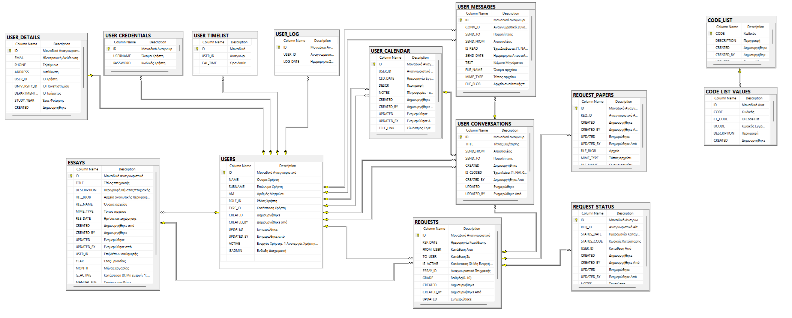

Main tables: `USERS`, `USER_DETAILS`, `USER_CREDENTIALS`, `VERIFICATION_CODE`, `ESSAYS`, `REQUESTS`, `REQUEST_STATUS`, `REQUEST_PAPERS`, `USER_CONVERSATIONS`, `USER_MESSAGES`, `USER_CALENDAR`, `USER_TIMELIST`, `USER_LOG`, `CHATBOT_HISTORY`, `CODE_LIST`, `CODE_LIST_VALUES`.
Every table has audit columns (`CREATED`, `CREATED_BY`, `UPDATED`, `UPDATED_BY`) filled by triggers.

A detailed description of every table and flow (in Greek) is in [docs/database-architecture.md](docs/database-architecture.md).

## Screenshots

| | |
|---|---|
| 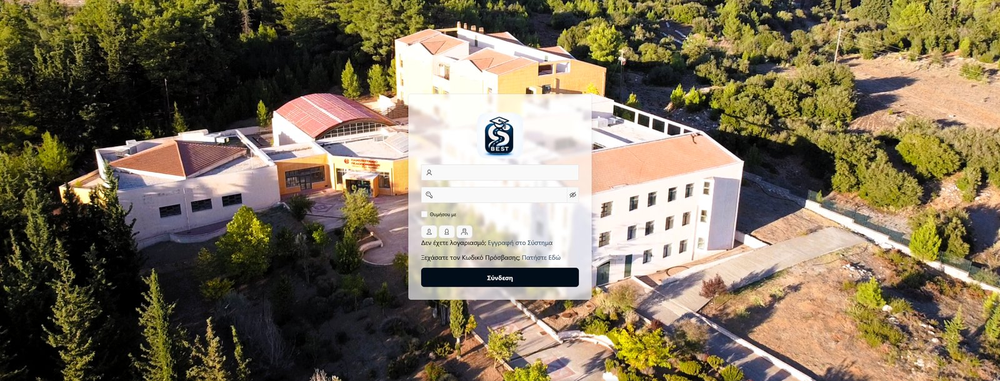 | 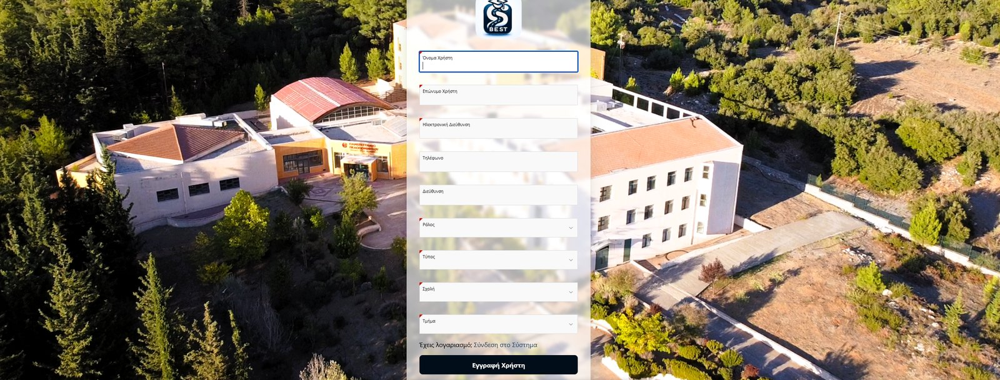 |
| **Login** | **Sign up with validations** |
| 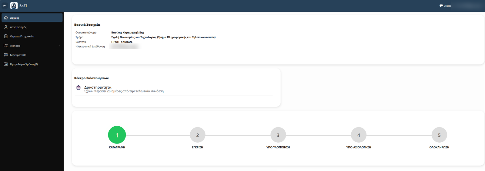 | 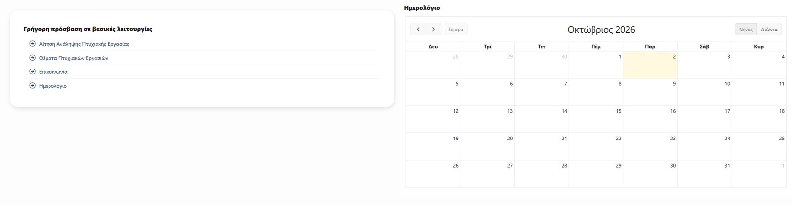 |
| **Home: user info, notifications, thesis progress** | **Quick links and calendar** |
| 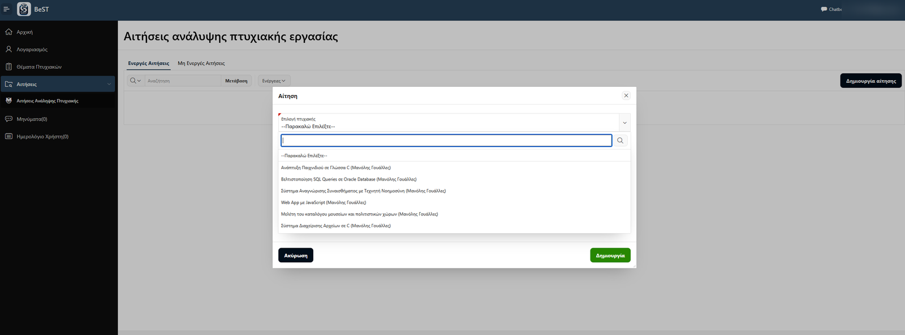 | 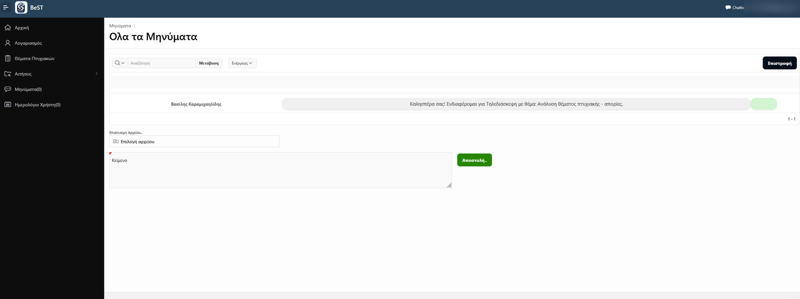 |
| **Applying for a thesis topic** | **Messages with attachments** |
| 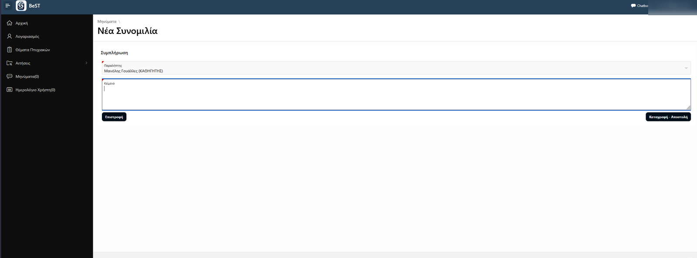 | 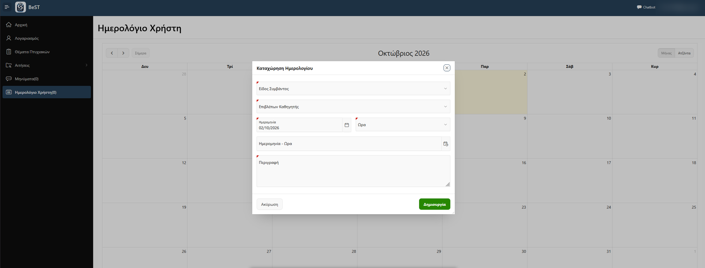 |
| **New conversation with a professor** | **Scheduling an appointment** |

<p align="center">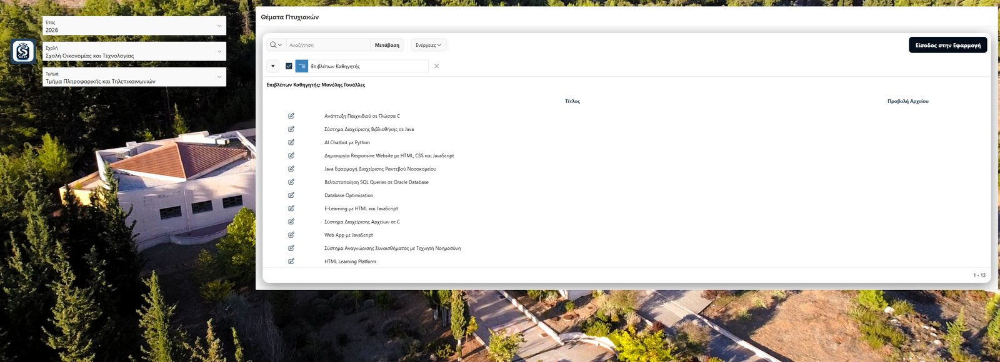<br><b>Public catalogue of thesis topics</b></p>

<p align="center">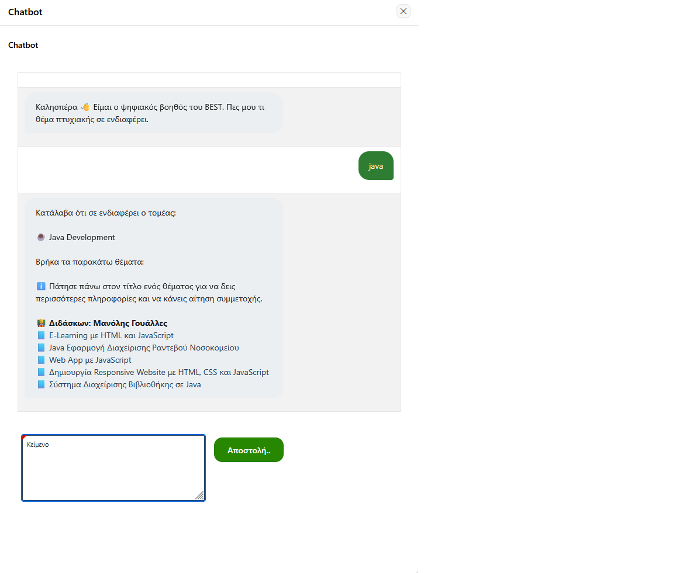<br><b>Chatbot suggesting thesis topics</b></p>

## Repository structure

```
database/01_install.sql         Core tables, sequences, triggers and PL/SQL functions
database/02_missing_tables.sql  Requests, status history, papers, calendar, availability, login log, chatbot
docs/                   ER diagram and database documentation
screenshots/            Application screenshots
```

> The APEX application source will be published after the thesis is submitted.

## Author

**Vasilis Karamichailidis** · [github.com/basiliskm](https://github.com/basiliskm)
