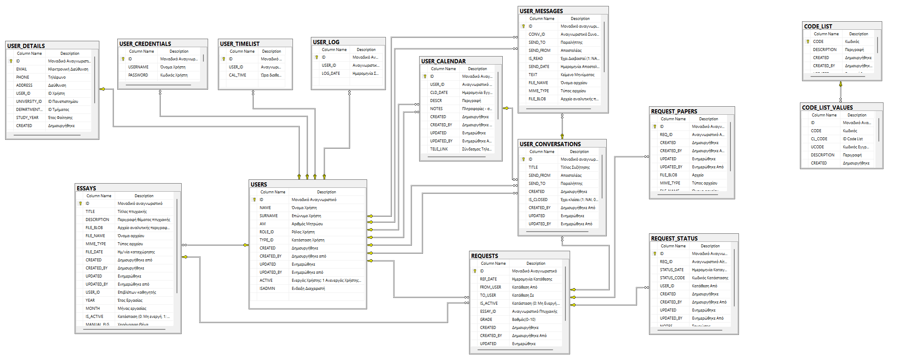

**ΑΡΧΙΤΕΚΤΟΝΙΚΗ ΒΑΣΗΣ ΔΕΔΟΜΕΝΩΝ**

**ΔΙΑΓΡΑΜΜΑ ΟΝΤΟΤΗΤΩΝ - ΣΥΣΧΕΤΙΣΕΩΝ (ER DIAGRAM)**

# ΕΓΓΡΑΦΗ ΚΑΙ ΑΥΘΕΝΤΙΚΟΠΟΙΗΣΗ ΧΡΗΣΤΩΝ

Η εφαρμογή παρέχει μηχανισμό εγγραφής και αυθεντικοποίησης χρηστών, ο
οποίος βασίζεται σε τρεις βασικούς πίνακες της βάσης δεδομένων:
USERS, USER\_DETAILS, USER\_CREDENTIALS.

## 1\. ΕΓΓΡΑΦΗ ΧΡΗΣΤΗ (USER REGISTRATION)

Κατά τη διαδικασία εγγραφής, ο χρήστης εισάγει τα προσωπικά και
ακαδημαϊκά του στοιχεία. Τα δεδομένα αυτά αποθηκεύονται στους
πίνακες USERS και USER\_DETAILS.

### ΠΙΝΑΚΑΣ USERS

  - ID: Μοναδικό αναγνωριστικό χρήστη

  - NAME: Όνομα χρήστη

  - SURNAME: Επώνυμο χρήστη

  - AM: Αριθμός Μητρώου

  - ROLE\_ID: Ρόλος χρήστη

  - TYPE\_ID: Κατηγορία χρήστη

  - ACTIVE: Κατάσταση χρήστη

  - ISADMIN: Ένδειξη διαχειριστή

### ΠΙΝΑΚΑΣ USER\_DETAILS

  - ID: Μοναδικό αναγνωριστικό εγγραφής

  - EMAIL: Ηλεκτρονική διεύθυνση

  - PHONE: Τηλέφωνο

  - ADDRESS: Διεύθυνση

  - USER\_ID: Συσχέτιση με USERS

  - UNIVERSITY\_ID: Πανεπιστήμιο

  - DEPARTMENT\_ID: Τμήμα

  - STUDY\_YEAR: Έτος φοίτησης
    
    **Έλεγχος Εγκυρότητας Δεδομένων (Validations)**
    
    Κατά τη διαδικασία εγγραφής χρήστη στην εφαρμογή, υλοποιείται ένας
    
    ολοκληρωμένος μηχανισμός εισαγωγής, ελέγχου και αποθήκευσης
    δεδομένων, με
    
    στόχο τη διασφάλιση της εγκυρότητας, της ασφάλειας και της ορθής
    λειτουργίας του
    
    συστήματος. Η διαδικασία ξεκινά με την καταχώρηση των προσωπικών και
    
    ακαδημαϊκών στοιχείων του χρήστη, τα οποία αποθηκεύονται στους
    πίνακες USERS και
    
    USER\_DETAILS της βάσης δεδομένων. Πιο συγκεκριμένα, στον πίνακα
    USERS
    
    αποθηκεύονται τα βασικά στοιχεία ταυτότητας, όπως το όνομα, το
    επώνυμο, ο αριθμός
    
    μητρώου, καθώς και πληροφορίες που σχετίζονται με τον ρόλο, την
    κατηγορία και την
    
    κατάσταση του χρήστη στο σύστημα.
    
    Παράλληλα, στον πίνακα USER\_DETAILS αποθηκεύονται συμπληρωματικά
    στοιχεία,
    
    όπως το email, το τηλέφωνο επικοινωνίας, η διεύθυνση, καθώς και
    πληροφορίες που
    
    αφορούν το πανεπιστήμιο, το τμήμα και το έτος σπουδών.

Κατά την εισαγωγή των παραπάνω δεδομένων, εφαρμόζονται αυστηροί έλεγχοι εγκυρότητας (validations) σε όλα τα πεδία, προκειμένου να αποτραπεί η καταχώρηση λανθασμένων ή μη αποδεκτών τιμών. Συγκεκριμένα, τα πεδία ονόματος και επωνύμου επιτρέπεται να περιέχουν αποκλειστικά αλφαριθμητικούς χαρακτήρες, είτε ελληνικούς είτε λατινικούς, ενώ δεν επιτρέπεται η χρήση αριθμών ή ειδικών συμβόλων. Το πεδίο του email ελέγχεται ως προς τη μορφή του και πρέπει υποχρεωτικά να ανήκει σε συγκεκριμένα επιτρεπόμενα domains, δηλαδή να καταλήγει σε @uop.gr ή @go.uop.gr, διασφαλίζοντας έτσι ότι ο χρήστης είναι μέλος του αντίστοιχου ακαδημαϊκού ιδρύματος. Σε περίπτωση μη έγκυρης τιμής, εμφανίζεται κατάλληλο μήνυμα καθοδήγησης προς τον χρήστη. Αντίστοιχα, το πεδίο του τηλεφώνου ελέγχεται ώστε να περιέχει έγκυρο αριθμό τηλεφώνου, σύμφωνα με το προκαθορισμένο format της εφαρμογής, και απορρίπτεται σε περίπτωση μη συμμόρφωσης.

## 2\. ΔΙΑΔΙΚΑΣΙΑ ΕΠΙΒΕΒΑΙΩΣΗΣ ΧΡΗΣΤΗ(EMAIL VERIFICATION)

Μετά την επιτυχή καταχώρηση και τον αρχικό έλεγχο των στοιχείων,
ακολουθεί

ένα ενδιάμεσο στάδιο επιβεβαίωσης του χρήστη μέσω ηλεκτρονικού
ταχυδρομείου.

Το σύστημα δημιουργεί έναν τυχαίο, μοναδικό κωδικό επαλήθευσης
(verification

code), ο οποίος αποθηκεύεται στον Πίνακα VERIFICATION\_CODE και
αποστέλλεται

στο email που έχει δηλώσει ο χρήστης κατά την εγγραφή.

Ο χρήστης καλείται να ανακτήσει τον κωδικό αυτό από το email του και να
τον

εισάγει στην εφαρμογή. Η ορθότητα του κωδικού ελέγχεται από το σύστημα
και

μόνο σε περίπτωση επιτυχούς επαλήθευσης επιτρέπεται η συνέχιση της

διαδικασίας εγγραφής.

Σε αντίθετη περίπτωση, η διαδικασία διακόπτεται και ο χρήστης
ενημερώνεται με

κατάλληλο μήνυμα σφάλματος. Η συγκεκριμένη διαδικασία διασφαλίζει την

εγκυρότητα του email και ενισχύει την ασφάλεια της εφαρμογής,
αποτρέποντας τη

δημιουργία λογαριασμών με ψευδή ή μη προσβάσιμα στοιχεία επικοινωνίας.

## 3\. ΔΗΜΙΟΥΡΓΙΑ ΣΤΟΙΧΕΙΩΝ ΣΥΝΔΕΣΗΣ (AUTHENTICATION)

## ΠΙΝΑΚΑΣ USER\_CREDENTIALS

  - ID: Μοναδικό αναγνωριστικό

  - USERNAME: Όνομα χρήστη

  - PASSWORD: Κωδικός πρόσβασης
    
    **Έλεγχος Εγκυρότητας Κωδικού (Password Validation)**
    
    Αφού ολοκληρωθεί επιτυχώς η επιβεβαίωση του χρήστη, ακολουθεί η
    δημιουργία των στοιχείων αυθεντικοποίησης, τα οποία
    αποθηκεύονται στον πίνακα USER\_CREDENTIALS. Σε αυτό το
    στάδιο, ο χρήστης ορίζει το όνομα χρήστη (username) και τον κωδικό
    πρόσβασης (password), τα οποία θα χρησιμοποιεί για τη σύνδεσή του
    στην εφαρμογή. Και σε αυτή τη φάση εφαρμόζονται έλεγχοι
    εγκυρότητας, κυρίως όσον αφορά τον κωδικό πρόσβασης.
    Συγκεκριμένα, ο κωδικός πρέπει να αποτελείται από τουλάχιστον
    έξι χαρακτήρες, εξασφαλίζοντας ένα βασικό επίπεδο ασφάλειας.
    Επιπλέον, ο χρήστης καλείται να εισάγει τον κωδικό δύο φορές
    (password και confirm password), και το σύστημα ελέγχει ότι οι δύο
    τιμές ταυτίζονται. Σε περίπτωση που οι τιμές διαφέρουν, η
    διαδικασία δεν προχωρά και εμφανίζεται σχετικό μήνυμα
    σφάλματος, ζητώντας από τον χρήστη να επαναλάβει την εισαγωγή.
    
    Συνολικά, η διαδικασία εγγραφής και αυθεντικοποίησης του χρήστη
    αποτελεί μια πολυεπίπεδη ροή ενεργειών, η οποία περιλαμβάνει
    την καταχώρηση δεδομένων, τον έλεγχο εγκυρότητας, την επιβεβαίωση
    μέσω email και τη δημιουργία ασφαλών στοιχείων σύνδεσης. Η
    προσέγγιση αυτή διασφαλίζει την ποιότητα των δεδομένων,
    την ορθότητα των στοιχείων επικοινωνίας και την ασφαλή πρόσβαση
    των χρηστών στο σύστημα, συμβάλλοντας στη συνολική αξιοπιστία και
    λειτουργικότητα της εφαρμογής.

## 4\. ΣΥΝΔΕΣΗ ΧΡΗΣΤΗ ΚΑΙ ΕΠΑΝΑΦΟΡΑ ΚΩΔΙΚΟΥ (LOGIN, RESET PASSWORD)

Στο τελικό στάδιο της διαδικασίας, μετά την επιτυχή ολοκλήρωση της
εγγραφής και της δημιουργίας των στοιχείων αυθεντικοποίησης, ο
χρήστης μεταφέρεται στη σελίδα σύνδεσης της εφαρμογής. Στη σελίδα
αυτή καλείται να εισάγει τα στοιχεία πρόσβασης που έχει ορίσει,
δηλαδή το όνομα χρήστη (username) και τον κωδικό πρόσβασης
(password). Με την υποβολή των στοιχείων αυτών, ενεργοποιείται η
διαδικασία αυθεντικοποίησης (authentication), κατά την οποία το
σύστημα ελέγχει την εγκυρότητα των δεδομένων σε αντιστοιχία με τις
εγγραφές που υπάρχουν στον πίνακα USER\_CREDENTIALS της βάσης
δεδομένων. Σε περίπτωση που τα στοιχεία είναι ορθά και
αντιστοιχούν σε ενεργό χρήστη, η αυθεντικοποίηση θεωρείται
επιτυχής και ο χρήστης αποκτά πρόσβαση στην εφαρμογή, μεταφερόμενος
στο αντίστοιχο περιβάλλον χρήσης. Αντίθετα, σε περίπτωση λανθασμένων
στοιχείων, η πρόσβαση απορρίπτεται και εμφανίζεται κατάλληλο μήνυμα
σφάλματος, ενημερώνοντας τον χρήστη για την αποτυχία της σύνδεσης.

Παράλληλα, στη σελίδα σύνδεσης παρέχεται η δυνατότητα επαναφοράς κωδικού
πρόσβασης μέσω της επιλογής «Ξεχάσατε τον κωδικό;», η οποία εξυπηρετεί
περιπτώσεις όπου ο χρήστης δεν θυμάται τον κωδικό του. Επιλέγοντας τη
συγκεκριμένη λειτουργία, ο χρήστης καλείται να εισάγει το email που
έχει δηλώσει κατά την εγγραφή του. Το σύστημα, αφού επιβεβαιώσει την
ύπαρξη του email, δημιουργεί έναν νέο τυχαίο κωδικό επαλήθευσης
(verification code), ο οποίος αποθηκεύεται εκ νέου στον πίνακα
VERIFICATION\_CODE και αποστέλλεται στο ηλεκτρονικό ταχυδρομείο του
χρήστη.

Ο χρήστης στη συνέχεια ελέγχει το email του, ανακτά τον κωδικό
επαλήθευσης και τον εισάγει στο αντίστοιχο πεδίο της
εφαρμογής. Το σύστημα πραγματοποιεί έλεγχο εγκυρότητας του
κωδικού και, εφόσον αυτός είναι σωστός, επιτρέπει τη μετάβαση στο
επόμενο στάδιο, το οποίο αφορά τη δημιουργία νέου κωδικού πρόσβασης.
Σε αντίθετη περίπτωση, η διαδικασία δεν προχωρά και ο χρήστης
ενημερώνεται για την αποτυχία επαλήθευσης.

Κατά τη δημιουργία του νέου κωδικού, εφαρμόζονται εκ νέου οι ίδιοι
κανόνες εγκυρότητας που ισχύουν και κατά την αρχική εγγραφή,
δηλαδή ο κωδικός πρέπει να έχει ελάχιστο μήκος έξι χαρακτήρων και
να ταυτίζεται με το πεδίο επιβεβαίωσης (confirm password). Μόλις
ολοκληρωθεί επιτυχώς η διαδικασία επαναφοράς, ο νέος κωδικός
αποθηκεύεται στον πίνακα USER\_CREDENTIALS, αντικαθιστώντας τον
προηγούμενο, και ο χρήστης μπορεί πλέον να χρησιμοποιήσει τα νέα
στοιχεία για να συνδεθεί στην εφαρμογή.

Η λειτουργία αυτή διασφαλίζει την ομαλή και ασφαλή ανάκτηση πρόσβασης
στο σύστημα, χωρίς να απαιτείται παρέμβαση διαχειριστή, ενώ παράλληλα
διατηρεί υψηλό επίπεδο ασφάλειας μέσω της επιβεβαίωσης ταυτότητας του
χρήστη με τη χρήση email και κωδικού επαλήθευσης.

## ΣΥΝΟΛΙΚΗ ΡΟΗ

1.  Ο χρήστης συμπληρώνει τα στοιχεία του

2.  Δημιουργούνται εγγραφές στους πίνακες USERS και USER\_DETAILS

3.  Δημιουργούνται credentials στον USER\_CREDENTIALS

4.  Ο χρήστης μπορεί να συνδεθεί
    
    **ΚΑΤΑΓΡΑΦΗ ΔΡΑΣΤΗΡΙΟΤΗΤΑΣ ΧΡΗΣΤΗ**

## ΠΙΝΑΚΑΣ USER\_LOG

  - ID: Μοναδικό αναγνωριστικό

  - USER\_ID: Αναγνωριστικό χρήστη (καθηγητή)

  - LOG\_TIME: Ημερομηνία σύνδεσης
    
    Μετά την επιτυχή διαδικασία αυθεντικοποίησης και την είσοδο του
    χρήστη στην εφαρμογή, ενεργοποιείται ένας μηχανισμός καταγραφής
    δραστηριότητας, ο οποίος αποσκοπεί στην παρακολούθηση της χρήσης του
    συστήματος και στη δημιουργία ιστορικού συνδέσεων. Συγκεκριμένα,
    κάθε φορά που ένας χρήστης συνδέεται επιτυχώς στην εφαρμογή,
    δημιουργείται μία νέα εγγραφή στον πίνακα USER\_LOG της βάσης
    δεδομένων. Η εγγραφή αυτή περιλαμβάνει κατ’ ελάχιστον το
    αναγνωριστικό του χρήστη (user\_id), το οποίο συνδέεται με
    τον αντίστοιχο χρήστη στον πίνακα USERS, καθώς και την ημερομηνία
    και ώρα σύνδεσης (log\_date), καταγράφοντας με ακρίβεια το χρονικό
    σημείο πρόσβασης στο σύστημα.
    
    Ο πίνακας USER\_LOG λειτουργεί ως μηχανισμός αποθήκευσης της
    ιστορικότητας των συνδέσεων, επιτρέποντας την αναδρομική
    παρακολούθηση της δραστηριότητας κάθε χρήστη. Μέσω των δεδομένων
    αυτών, το σύστημα μπορεί να εξάγει χρήσιμες πληροφορίες σχετικά με
    τη συχνότητα χρήσης της εφαρμογής, την τελευταία ημερομηνία
    σύνδεσης, καθώς και χρονικά διαστήματα αδράνειας. Η καταγραφή
    αυτή μπορεί να αξιοποιηθεί τόσο για λόγους ενημέρωσης του χρήστη όσο
    και για λόγους ασφάλειας ή στατιστικής ανάλυσης.
    
    Η πληροφορία που συλλέγεται στον πίνακα USER\_LOG αξιοποιείται
    δυναμικά στην αρχική σελίδα της εφαρμογής, και συγκεκριμένα
    στο κέντρο ειδοποιήσεων (notification center), το οποίο αποτελεί
    βασικό σημείο αλληλεπίδρασης του χρήστη με το σύστημα μετά τη
    σύνδεσή του. Στο σημείο αυτό, το σύστημα ενημερώνει τον χρήστη
    σχετικά με το χρονικό διάστημα που έχει μεσολαβήσει από την
    τελευταία του είσοδο στην εφαρμογή. Πιο συγκεκριμένα,
    πραγματοποιείται υπολογισμός της διαφοράς μεταξύ της τρέχουσας
    ημερομηνίας και της πιο πρόσφατης προηγούμενης εγγραφής στον πίνακα
    USER\_LOG για τον συγκεκριμένο χρήστη.
    
    Το αποτέλεσμα αυτού του υπολογισμού εμφανίζεται με τη μορφή
    ενημερωτικού μηνύματος, όπως για παράδειγμα «Έχετε να
    συνδεθείτε X ημέρες», παρέχοντας στον χρήστη άμεση εικόνα της
    δραστηριότητάς του. Η λειτουργία αυτή ενισχύει την εμπειρία χρήσης,
    καθώς προσφέρει προσωποποιημένη πληροφόρηση και συμβάλλει στην
    αίσθηση παρακολούθησης της αλληλεπίδρασης με την εφαρμογή.
    Παράλληλα, μπορεί να λειτουργήσει και ως μηχανισμός υπενθύμισης,
    ενθαρρύνοντας τη συχνότερη χρήση του συστήματος.
    
    Συνολικά, η ενσωμάτωση του πίνακα USER\_LOG και η αξιοποίηση των
    δεδομένων του στο κέντρο ειδοποιήσεων αποτελούν σημαντικό
    στοιχείο της αρχιτεκτονικής της εφαρμογής, καθώς συνδυάζουν
    την καταγραφή λειτουργικών δεδομένων με την άμεση ενημέρωση του
    χρήστη, ενισχύοντας τόσο τη διαφάνεια όσο και τη χρηστικότητα του
    συστήματος.
    
    **ΔΙΑΧΕΙΡΙΣΗ ΔΙΑΘΕΣΙΜΟΤΗΤΑΣ ΚΑΙ ΠΡΟΓΡΑΜΜΑΤΙΣΜΟΣ ΣΥΝΑΝΤΗΣΕΩΝ**

## ΠΙΝΑΚΑΣ USER\_TIMELIST

  - ID: Μοναδικό αναγνωριστικό

  - USER\_ID: Αναγνωριστικό χρήστη (καθηγητή)

  - CAL\_TIME: Ώρα διαθεσιμότητας

## ΠΙΝΑΚΑΣ USER\_CALENDAR

  - ID: Μοναδικό αναγνωριστικό

  - USER\_ID: Αναγνωριστικό χρήστη (καθηγητή)

  - TO\_USER: Αναγνωριστικό καθηγητή (παραλήπτης αιτήματος)

  - CLD\_DATE: Ημερομηνία και ώρα συνάντησης

  - DESCR: Περιγραφή συνάντησης

  - NOTES: Πρόσθετες πληροφορίες / σημειώσεις

  - TELE\_LINK: Σύνδεσμος τηλεδιάσκεψης

  - STATUS: Κατάσταση (1: Ενεργό, 0: Ανενεργό)

  - TYPE: Τύπος (1: Ραντεβού, 2: Τηλεδιάσκεψη)
    
    Σημαντικό μέρος της λειτουργικότητας της εφαρμογής αποτελεί η
    δυνατότητα προγραμματισμού συναντήσεων και τηλεδιασκέψεων
    μεταξύ φοιτητών και καθηγητών, η οποία υλοποιείται μέσω των
    πινάκων USER\_TIMELIST και USER\_CALENDAR. Η λειτουργία αυτή
    ενσωματώνεται πλήρως στην αρχική οθόνη της εφαρμογής, μέσω ενός
    δυναμικού ημερολογίου (calendar), καθώς και μέσω των αντίστοιχων
    επιλογών στο μενού πλοήγησης.
    
    Ο πίνακας USER\_TIMELIST χρησιμοποιείται για την καταγραφή της
    διαθεσιμότητας των καθηγητών. Συγκεκριμένα, κάθε καθηγητής,
    μέσω του προσωπικού του προφίλ, έχει τη δυνατότητα να δηλώσει τις
    ώρες κατά τις οποίες είναι διαθέσιμος για συναντήσεις ή
    τηλεδιασκέψεις. Για κάθε διαθέσιμο χρονικό slot που
    ορίζει, δημιουργείται μία εγγραφή στον πίνακα USER\_TIMELIST, η
    οποία περιλαμβάνει το αναγνωριστικό του χρήστη (user\_id) καθώς και
    την ώρα διαθεσιμότητας (cal\_time). Με τον τρόπο αυτό δημιουργείται
    ένα σύνολο διαθέσιμων χρονικών ζωνών, οι οποίες μπορούν να
    αξιοποιηθούν από τους φοιτητές για την κράτηση ραντεβού.
    
    Από την πλευρά του φοιτητή, η διαδικασία προγραμματισμού μιας
    συνάντησης πραγματοποιείται μέσω του ημερολογίου
    (USER\_CALENDAR). Ο φοιτητής επιλέγει τον καθηγητή με τον οποίο
    επιθυμεί να προγραμματίσει συνάντηση και το σύστημα ανακτά
    δυναμικά τις διαθέσιμες ώρες από τον πίνακα USER\_TIMELIST.
    Κατά την ανάκτηση αυτή, εφαρμόζεται επιπλέον έλεγχος ώστε να
    εμφανίζονται μόνο τα χρονικά διαστήματα τα οποία δεν έχουν ήδη
    δεσμευτεί από κάποιο άλλο ραντεβού. Με τον τρόπο αυτό αποφεύγονται
    διπλοκρατήσεις και διασφαλίζεται η ορθότητα του προγραμματισμού.
    
    Μόλις ο φοιτητής επιλέξει την επιθυμητή ημερομηνία και ώρα,
    δημιουργείται μία νέα εγγραφή στον πίνακα USER\_CALENDAR. Ο
    πίνακας αυτός αποτελεί τον βασικό μηχανισμό αποθήκευσης των
    προγραμματισμένων συναντήσεων και περιλαμβάνει κρίσιμες
    πληροφορίες όπως το αναγνωριστικό του χρήστη (user\_id), την
    ημερομηνία και ώρα της συνάντησης (cld\_date), καθώς και μία
    περιγραφή (descr) που αφορά το θέμα της συνάντησης. Επιπλέον,
    περιλαμβάνεται και το πεδίο tele\_link, το οποίο χρησιμοποιείται
    για την αποθήκευση του συνδέσμου τηλεδιάσκεψης.
    
    Η διαδικασία ολοκληρώνεται με τη συμμετοχή του καθηγητή, ο οποίος
    καλείται να αποδεχθεί το αίτημα συνάντησης. Κατά την αποδοχή, ο
    καθηγητής έχει τη δυνατότητα να συμπληρώσει τον σύνδεσμο
    τηλεδιάσκεψης (tele\_link), ο οποίος αποθηκεύεται στην
    αντίστοιχη εγγραφή του USER\_CALENDAR. Με τον τρόπο αυτό, η
    συνάντηση μετατρέπεται από απλό αίτημα σε επιβεβαιωμένο
    ραντεβού, έτοιμο προς υλοποίηση.
    
    Παράλληλα, η εφαρμογή αξιοποιεί τα δεδομένα του USER\_CALENDAR για
    την παροχή ενημέρωσης στον χρήστη μέσω του κέντρου ειδοποιήσεων
    (notification center) στην αρχική οθόνη. Συγκεκριμένα, εμφανίζονται
    πληροφορίες σχετικά με επερχόμενες συναντήσεις και τηλεδιασκέψεις,
    παρέχοντας στον χρήστη άμεση εικόνα του προγράμματός του. Οι
    ειδοποιήσεις αυτές συμβάλλουν στην καλύτερη οργάνωση του
    χρόνου και στη διασφάλιση ότι οι προγραμματισμένες συναντήσεις
    δεν θα παραληφθούν.
    
    Συνολικά, η συνδυασμένη λειτουργία των πινάκων USER\_TIMELIST και
    USER\_CALENDAR δημιουργεί ένα ολοκληρωμένο σύστημα διαχείρισης
    διαθεσιμότητας και προγραμματισμού συναντήσεων, το οποίο
    επιτρέπει την αποδοτική επικοινωνία μεταξύ φοιτητών και
    καθηγητών, εξασφαλίζοντας παράλληλα ακρίβεια, ευελιξία και
    ευχρηστία στη διαδικασία οργάνωσης των ραντεβού.
    
    **ΔΙΑΧΕΙΡΙΣΗ ΣΥΝΟΜΙΛΙΩΝ ΚΑΙ ΑΝΤΑΛΛΑΓΗ ΜΗΝΥΜΑΤΩΝ**

## ΠΙΝΑΚΑΣ USER\_CONVERSATIONS

  - ID: Μοναδικό αναγνωριστικό

  - TITLE: Τίτλος συνομιλίας

  - SEND\_FROM: Αναγνωριστικό αποστολέα

  - SEND\_TO: Αναγνωριστικό παραλήπτη

  - IS\_CLOSED: Ένδειξη κατάστασης (1: Κλειστή, 0: Ενεργή)

  - CLD\_ID: Συσχέτιση με εγγραφή ημερολογίου (USER\_CALENDAR)

  - REQ\_ID: Συσχέτιση με αίτηση (REQUESTS)

## ΠΙΝΑΚΑΣ USER\_MESSAGES

  - ID: Μοναδικό αναγνωριστικό

  - CONV\_ID: Αναγνωριστικό συνομιλίας

  - SEND\_FROM: Αναγνωριστικό αποστολέα

  - SEND\_TO: Αναγνωριστικό παραλήπτη

  - IS\_READ: Ένδειξη ανάγνωσης (1: Ναι, 0: Όχι)

  - SEND\_DATE: Ημερομηνία αποστολής

  - TEXT: Κείμενο μηνύματος

  - FILE\_NAME: Όνομα αρχείου

  - MIME\_TYPE: Τύπος αρχείου

  - FILE\_BLOB: Αρχείο (δυαδικά δεδομένα)
    
    Η λειτουργικότητα ανταλλαγής μηνυμάτων αποτελεί βασικό μέσο
    επικοινωνίας της εφαρμογής, επιτρέποντας την άμεση και
    οργανωμένη αλληλεπίδραση μεταξύ φοιτητών και καθηγητών. Η
    υλοποίηση της συγκεκριμένης λειτουργίας βασίζεται στους
    πίνακες USER\_CONVERSATIONS και USER\_MESSAGES, οι οποίοι
    συνεργάζονται ώστε να υποστηρίζουν πλήρως τη ροή των συνομιλιών.
    
    Ο πίνακας USER\_CONVERSATIONS χρησιμοποιείται για την αποθήκευση των
    συνομιλιών μεταξύ δύο χρηστών, ενώ παράλληλα λειτουργεί ως
    μηχανισμός συσχέτισης της επικοινωνίας με συγκεκριμένες
    ενέργειες της εφαρμογής. Συγκεκριμένα, μέσω των πεδίων cld\_id
    και req\_id, κάθε συνομιλία μπορεί να συνδέεται είτε με μία
    εγγραφή του ημερολογίου (USER\_CALENDAR) είτε με μία αίτηση
    (REQUESTS).
    
    Με τον τρόπο αυτό, κάθε φορά που δημιουργείται μία νέα εγγραφή στο
    ημερολόγιο, όπως για παράδειγμα κατά τον προγραμματισμό ενός
    ραντεβού, το σύστημα δημιουργεί αυτόματα και μία νέα συνομιλία
    μεταξύ των εμπλεκόμενων χρηστών (φοιτητή και καθηγητή). Αντίστοιχα,
    κατά τη δημιουργία μίας νέας αίτησης, δημιουργείται αυτόματα
    σχετική συνομιλία, επιτρέποντας την άμεση επικοινωνία των
    χρηστών πάνω στο συγκεκριμένο θέμα.
    
    Η προσέγγιση αυτή διασφαλίζει ότι η επικοινωνία είναι άμεσα
    συνδεδεμένη με το εκάστοτε αντικείμενο (ραντεβού ή αίτηση),
    διευκολύνοντας την οργάνωση και την παρακολούθηση της πληροφορίας. Ο
    χρήστης μπορεί εύκολα να εντοπίσει και να διαχειριστεί τις
    συνομιλίες που σχετίζονται με συγκεκριμένες δραστηριότητες
    της εφαρμογής, χωρίς να απαιτείται αναζήτηση σε μη σχετιζόμενα
    μηνύματα.
    
    Επιπλέον, σε περίπτωση διαγραφής μιας εγγραφής ημερολογίου ή μιας
    αίτησης, διαγράφεται αυτόματα και η αντίστοιχη συνομιλία, ώστε να
    αποφεύγεται η εμφάνιση συνομιλιών που δεν σχετίζονται πλέον με
    ενεργές ενέργειες της εφαρμογής.
    
    Κάθε συνομιλία λειτουργεί ως δοχείο (container) μηνυμάτων, τα οποία
    αποθηκεύονται στον πίνακα USER\_MESSAGES. Ο πίνακας αυτός αποτελεί
    τον βασικό μηχανισμό καταγραφής της επικοινωνίας, καθώς κάθε μήνυμα
    που αποστέλλεται αποθηκεύεται ως ξεχωριστή εγγραφή και συνδέεται με
    τη συνομιλία μέσω του πεδίου conv\_id.
    
    Κατά την αποστολή ενός μηνύματος, το σύστημα δημιουργεί μία νέα
    εγγραφή στον πίνακα USER\_MESSAGES, στην οποία καταγράφονται ο
    αποστολέας, ο παραλήπτης, η ημερομηνία αποστολής (send\_date),
    καθώς και το περιεχόμενο του μηνύματος (text). Παράλληλα,
    υποστηρίζεται και η αποστολή αρχείων, μέσω των πεδίων
    file\_name, mime\_type και file\_blob, επιτρέποντας την ανταλλαγή
    εγγράφων και λοιπού υλικού μεταξύ των χρηστών.
    
    Το πεδίο is\_read χρησιμοποιείται για την παρακολούθηση της
    κατάστασης ανάγνωσης των μηνυμάτων, επιτρέποντας στο
    σύστημα να εντοπίζει τα μη αναγνωσμένα μηνύματα και να
    ενημερώνει κατάλληλα τον χρήστη μέσω ειδοποιήσεων.
    
    Από πλευράς διεπαφής, οι συνομιλίες εμφανίζονται συγκεντρωτικά στον
    χρήστη, ο οποίος μπορεί να επιλέξει μία συνομιλία και να προβάλει
    το ιστορικό των μηνυμάτων που σχετίζονται με αυτή. Η ανάκτηση των
    μηνυμάτων πραγματοποιείται με βάση το conv\_id, διασφαλίζοντας ότι
    κάθε συνομιλία περιλαμβάνει αποκλειστικά τα αντίστοιχα δεδομένα.
    
    Συνολικά, η συνδυασμένη λειτουργία των πινάκων USER\_CONVERSATIONS
    και USER\_MESSAGES υλοποιεί ένα ολοκληρωμένο και δυναμικό σύστημα
    ανταλλαγής μηνυμάτων, το οποίο ενσωματώνεται πλήρως με τις
    υπόλοιπες λειτουργίες της εφαρμογής και ενισχύει ουσιαστικά
    την επικοινωνία και τη συνεργασία μεταξύ των χρηστών.

## ΔΙΑΧΕΙΡΙΣΗ ΑΙΤΗΣΕΩΝ ΠΤΥΧΙΑΚΩΝ ΕΡΓΑΣΙΩΝ

## ΠΙΝΑΚΑΣ REQUESTS

  - ID: Μοναδικό αναγνωριστικό

  - REF\_DATE: Ημερομηνία Κατάθεσης

  - FROM\_USER: Κατάθεση Από

  - TO\_USER: Κατάθεση Σε

  - IS\_ACTIVE: Ένδειξη κατάστασης (0: Μη ενεργή, 1: Ενεργή)

  - ESSAY\_ID: Συσχέτιση με πτυχιακή εργασία (ESSAYS)

  - GRADE: Βαθμός

## ΠΙΝΑΚΑΣ REQUEST\_STATUS

  - ID: Μοναδικό αναγνωριστικό

  - REQ\_ID: Συσχέτιση με αίτηση (REQUESTS)

  - STATUS\_DATE: Ημερομηνία – Ώρα καταγραφής

  - STATUS\_CODE: Κωδικός Κατάστασης

  - USER\_ID: Καταγραφή Από

## ΠΙΝΑΚΑΣ REQUEST\_PAPERS

  - ID: Μοναδικό αναγνωριστικό

  - REQ\_ID: Συσχέτιση με αίτηση (REQUESTS)

  - FILE\_NAME: Όνομα αρχείου αναφοράς

  - MIME\_TYPE: Τύπος αρχείου

  - FILE\_BLOB: Αρχείο (δυαδικά δεδομένα)
    
    Η λειτουργικότητα διαχείρισης αιτήσεων πτυχιακών εργασιών αποτελεί
    βασικό πυλώνα της εφαρμογής, καθώς υποστηρίζει ολόκληρο τον κύκλο
    ζωής μιας πτυχιακής, από την αρχική υποβολή μέχρι την τελική
    αξιολόγηση και ολοκλήρωση. Η υλοποίηση βασίζεται κυρίως στους
    πίνακες REQUESTS, REQUEST\_STATUS και REQUEST\_PAPERS, οι οποίοι
    συνεργάζονται ώστε να αποτυπώνουν τόσο την τρέχουσα κατάσταση
    όσο και το ιστορικό εξέλιξης κάθε αίτησης.
    
    Η διαδικασία ξεκινά από τον φοιτητή, ο οποίος υποβάλλει αίτηση για
    την ανάληψη ενός θέματος πτυχιακής εργασίας προς έναν καθηγητή. Με
    την ενέργεια αυτή δημιουργείται μία νέα εγγραφή στον πίνακα
    REQUESTS, η οποία περιλαμβάνει τα βασικά στοιχεία της αίτησης και
    λειτουργεί ως το κεντρικό σημείο αναφοράς για την παρακολούθησή
    της.
    
    Παράλληλα, με τη δημιουργία της αίτησης καταγράφεται και η αρχική
    της κατάσταση στον πίνακα REQUEST\_STATUS. Ο πίνακας αυτός
    χρησιμοποιείται για την αποθήκευση του ιστορικού των
    καταστάσεων της αίτησης, επιτρέποντας την πλήρη ιχνηλάτηση
    της πορείας της μέσα στο σύστημα. Η πρώτη εγγραφή αντιστοιχεί στην
    υποβολή της αίτησης.
    
    Στη συνέχεια, ο καθηγητής εξετάζει την αίτηση και καλείται να
    αποφασίσει εάν θα την αποδεχθεί ή θα την απορρίψει. Σε
    περίπτωση αποδοχής, καταγράφεται νέα εγγραφή στον πίνακα
    REQUEST\_STATUS με κατάσταση «έγκριση», ενώ σε περίπτωση απόρριψης
    καταγράφεται αντίστοιχα η κατάσταση «απόρριψη». Η καταγραφή αυτή
    διατηρεί το ιστορικό των ενεργειών και επιτρέπει την αναδρομή σε
    προηγούμενα στάδια.
    
    Εφόσον η αίτηση εγκριθεί, μεταβαίνει σε κατάσταση «υπό υλοποίηση».
    Σε αυτό το στάδιο, ο φοιτητής αναλαμβάνει την εκπόνηση της
    πτυχιακής εργασίας, ενώ το σύστημα συνεχίζει να παρακολουθεί
    την εξέλιξη μέσω των αντίστοιχων καταγραφών στον πίνακα
    REQUEST\_STATUS. Παράλληλα, στην αρχική οθόνη της εφαρμογής
    παρουσιάζεται μία γραμμή προόδου, η οποία παρέχει οπτική
    αναπαράσταση της εξέλιξης της αίτησης στα επιμέρους στάδια,
    προσφέροντας στον χρήστη άμεση εικόνα της κατάστασής της.
    
    Όταν ο φοιτητής ολοκληρώσει την εργασία του, υποβάλλει την τελική
    αναφορά. Η αναφορά αυτή αποθηκεύεται στον πίνακα REQUEST\_PAPERS,
    ο οποίος υποστηρίζει την αποθήκευση των αρχείων που σχετίζονται με
    την πτυχιακή εργασία. Με την υποβολή της αναφοράς, καταγράφεται
    νέα κατάσταση «υπό αξιολόγηση» στον πίνακα REQUEST\_STATUS,
    σηματοδοτώντας την έναρξη της διαδικασίας αξιολόγησης.
    
    Κατά το στάδιο της αξιολόγησης, ο καθηγητής εξετάζει την υποβληθείσα
    εργασία και έχει τη δυνατότητα είτε να την εγκρίνει είτε να ζητήσει
    διορθώσεις. Στην πρώτη περίπτωση, καταχωρείται βαθμός και η αίτηση
    μεταβαίνει σε κατάσταση «ολοκλήρωση», ολοκληρώνοντας τον κύκλο ζωής
    της πτυχιακής. Στη δεύτερη περίπτωση, η αίτηση επιστρέφει σε
    κατάσταση «υπό υλοποίηση», επιτρέποντας στον φοιτητή να
    προβεί στις απαραίτητες διορθώσεις και να υποβάλει εκ νέου την
    εργασία του.
    
    Η χρήση του πίνακα REQUEST\_STATUS για την καταγραφή όλων των
    μεταβάσεων εξασφαλίζει την πλήρη ιστορικότητα της αίτησης,
    ενώ ο πίνακας REQUEST\_PAPERS παρέχει τη δυνατότητα διαχείρισης
    των υποβαλλόμενων αρχείων. Με τον τρόπο αυτό, το σύστημα
    υποστηρίζει μια δομημένη και διαφανή διαδικασία
    διαχείρισης πτυχιακών εργασιών, διευκολύνοντας τόσο τον
    φοιτητή όσο και τον καθηγητή σε κάθε στάδιο της συνεργασίας τους.

## ΔΙΑΧΕΙΡΙΣΗ ΘΕΜΑΤΩΝ ΠΤΥΧΙΑΚΩΝ ΕΡΓΑΣΙΩΝ

## ΠΙΝΑΚΑΣ ESSAYS

  - ID: Μοναδικό αναγνωριστικό

  - TITLE: Τίτλος Πτυχιακής

  - DESCRIPTION: Περιγραφή θέματος πτυχιακής

  - USER\_ID: Επιβλέπων Καθηγητής

  - YEAR: Έτος εργασίας

  - IS\_ACTIVE: Ένδειξη κατάστασης (0: Μη ενεργή, 1: Ενεργή)

  - MANUAL\_FLG: Χειρόγρφαο Θέμα (0: Οχι, 1: Ναι)

  - FILE\_NAME: Όνομα αρχείου αναλυτικής περιγραφής

  - MIME\_TYPE: Τύπος αρχείου

  - FILE\_BLOB: Αρχείο (δυαδικά δεδομένα)
    
    Ο πίνακας ESSAYS χρησιμοποιείται για την αποθήκευση των διαθέσιμων
    θεμάτων πτυχιακών εργασιών, τα οποία προσφέρονται από τους
    καθηγητές ανά πανεπιστήμιο. Κάθε εγγραφή περιλαμβάνει
    βασικές πληροφορίες όπως τον τίτλο (title), την περιγραφή
    (descr), καθώς και έναν σύνδεσμο (link) που μπορεί να παραπέμπει σε
    σχετικό υλικό ή πρόσθετες οδηγίες.
    
    Μέσω της συσχέτισης με τα πεδία professor\_id και university\_id,
    διασφαλίζεται ότι κάθε θέμα συνδέεται με τον αντίστοιχο καθηγητή
    και το πανεπιστήμιο στο οποίο ανήκει, επιτρέποντας την οργανωμένη
    παρουσίαση και αναζήτηση των διαθέσιμων πτυχιακών εργασιών.
    
    Επιπλέον, παρέχεται η δυνατότητα δημιουργίας χειρογράφου θέματος
    μέσω του πεδίου is\_manual. Στην περίπτωση αυτή, ο φοιτητής
    μπορεί να προτείνει ένα δικό του θέμα πτυχιακής εργασίας, το
    οποίο δεν υπάρχει ήδη στη λίστα των διαθέσιμων θεμάτων, και να το
    υποβάλει προς έγκριση σε καθηγητή της επιλογής του.
    
    Εφόσον το χειρόγραφο θέμα γίνει αποδεκτό από τον καθηγητή,
    εντάσσεται κανονικά στη ροή διαχείρισης αιτήσεων της
    εφαρμογής, ακολουθώντας την ίδια διαδικασία που περιγράφηκε
    προηγουμένως, από την έγκριση έως την υλοποίηση και την τελική
    αξιολόγηση.
    
    Με τον τρόπο αυτό, το σύστημα συνδυάζει τόσο την οργανωμένη διάθεση
    προκαθορισμένων θεμάτων όσο και την ευελιξία υποβολής νέων
    προτάσεων από τους φοιτητές, ενισχύοντας τη διαδραστικότητα
    και την προσαρμοστικότητα της εφαρμογής στις ανάγκες των χρηστών.

## ΔΙΑΧΕΙΡΙΣΗ ΛΙΣΤΩΝ ΤΙΜΩΝ (CODE LISTS)

## ΠΙΝΑΚΑΣ CODE\_LIST

  - ID: Μοναδικό αναγνωριστικό

  - CODE: Κωδικός εγγραφής

  - DESCRIPTION: Περιγραφή Λίστας

## ΠΙΝΑΚΑΣ CODE\_LIST\_VALUES

  - ID: Μοναδικό αναγνωριστικό

  - CODE: Κωδικός εγγραφής

  - CL\_CODE: Κωδικός εγγραφής συσχέτιση με CODE\_LIST

  - UCODE: Ενοποιημένος κωδικός εγγραφής (CL\_CODE + CODE)

  - DESCRIPTION: Περιγραφή
    
    Οι πίνακες CODE\_LIST και CODE\_LIST\_VALUES χρησιμοποιούνται για τη
    διαχείριση παραμετρικών λιστών τιμών, οι οποίες αξιοποιούνται σε
    πολλαπλά σημεία της εφαρμογής. Η χρήση τους επιτρέπει την
    κεντρική αποθήκευση και διαχείριση δεδομένων που εμφανίζονται
    ως επιλογές σε πεδία της διεπαφής, χωρίς να απαιτείται σκληρή
    κωδικοποίηση (hardcoding).
    
    Ο πίνακας CODE\_LIST λειτουργεί ως ορισμός της εκάστοτε λίστας (π.χ.
    καταστάσεις αιτήσεων, ρόλοι χρηστών, πανεπιστήμια, σχολές), ενώ ο
    πίνακας CODE\_LIST\_VALUES περιλαμβάνει τις επιμέρους τιμές που
    ανήκουν σε κάθε λίστα.
    
    Με τον τρόπο αυτό, η εφαρμογή αποκτά ευελιξία και επεκτασιμότητα,
    καθώς νέες τιμές μπορούν να προστεθούν ή να τροποποιηθούν
    δυναμικά, χωρίς αλλαγές στον κώδικα. Οι λίστες αυτές
    χρησιμοποιούνται ευρέως σε φόρμες καταχώρησης και φίλτρα
    αναζήτησης, διασφαλίζοντας ομοιομορφία και συνέπεια στα δεδομένα
    που διακινούνται στο σύστημα.
    
    Συνολικά, η αξιοποίηση των CODE\_LIST και CODE\_LIST\_VALUES
    συμβάλλει στη δημιουργία μιας παραμετροποιήσιμης και εύκολα
    διαχειρίσιμης αρχιτεκτονικής δεδομένων, η οποία υποστηρίζει
    αποτελεσματικά τις ανάγκες της εφαρμογής.

## ΑΡΧΙΤΕΚΤΟΝΙΚΗ ΒΑΣΗΣ

Η αρχιτεκτονική της βάσης δεδομένων έχει σχεδιαστεί με γνώμονα τη
διασφάλιση της ακεραιότητας, της συνέπειας και της
επεκτασιμότητας των δεδομένων, ακολουθώντας καθιερωμένες
αρχές σχεδιασμού σχεσιακών βάσεων δεδομένων. Συγκεκριμένα, έχει δομηθεί
με βάση κανόνες κανονικοποίησης, με στόχο την αποφυγή πλεονασμού και την
εξάλειψη ανωμαλιών κατά την εισαγωγή, ενημέρωση και διαγραφή δεδομένων.
Κάθε βασική οντότητα της εφαρμογής αποτυπώνεται σε διακριτό πίνακα, ενώ
οι σχέσεις μεταξύ τους υλοποιούνται μέσω κατάλληλων πρωτευόντων και
ξένων κλειδιών (primary και foreign keys), διασφαλίζοντας τη λογική
συνοχή και τη διασύνδεση των δεδομένων σε όλο το σύστημα.

Ιδιαίτερη έμφαση έχει δοθεί στη διατήρηση της μοναδικότητας των
εγγραφών, καθώς κάθε πίνακας διαθέτει πρωτεύον κλειδί (ID), το
οποίο εγγυάται ότι κάθε καταχώρηση είναι μοναδική και μπορεί να
ανακτηθεί με σαφήνεια. Η αυτόματη δημιουργία των τιμών αυτών
επιτυγχάνεται μέσω της χρήσης sequences σε συνδυασμό με triggers,
τα οποία ενεργοποιούνται κατά την εισαγωγή νέων εγγραφών και
αναλαμβάνουν την αυτόματη απόδοση του επόμενου διαθέσιμου
αναγνωριστικού. Με τον τρόπο αυτό αποφεύγεται η ανάγκη χειροκίνητης
διαχείρισης των IDs και μειώνεται σημαντικά η πιθανότητα σφαλμάτων ή
συγκρούσεων.

Παράλληλα, έχουν υλοποιηθεί μηχανισμοί ελέγχου ακεραιότητας
(constraints), οι οποίοι επιβάλλουν κανόνες εγκυρότητας στα δεδομένα,
όπως υποχρεωτικά πεδία, μοναδικότητα τιμών όπου απαιτείται, καθώς και
ορθότητα συσχετίσεων μεταξύ πινάκων. Οι περιορισμοί αυτοί λειτουργούν σε
επίπεδο βάσης δεδομένων, διασφαλίζοντας ότι ακόμη και σε περιπτώσεις
άμεσης πρόσβασης ή μελλοντικών επεκτάσεων, τα δεδομένα παραμένουν
συνεπή και αξιόπιστα.

Επιπλέον, για τη βελτίωση της απόδοσης των ερωτημάτων και της συνολικής
λειτουργίας της εφαρμογής, έχουν αξιοποιηθεί κατάλληλοι δείκτες
(indexes) σε πεδία που χρησιμοποιούνται συχνά σε αναζητήσεις,
συσχετίσεις και ταξινομήσεις. Η χρήση των indexes συμβάλλει
σημαντικά στη μείωση του χρόνου απόκρισης, ιδιαίτερα σε περιπτώσεις
μεγάλου όγκου δεδομένων, καθιστώντας το σύστημα αποδοτικό και
κλιμακούμενο.

Σημαντικό μέρος της αρχιτεκτονικής αποτελεί και η υλοποίηση μηχανισμών
καταγραφής ενεργειών (audit trail). Συγκεκριμένα, όλοι οι πίνακες της
βάσης δεδομένων περιλαμβάνουν κοινά πεδία παρακολούθησης, όπως created,
updated, created\_by και updated\_by. Τα πεδία αυτά ενημερώνονται
αυτόματα μέσω triggers, τα οποία ενεργοποιούνται κατά την
εισαγωγή και τροποποίηση εγγραφών. Με τον τρόπο αυτό
καταγράφεται με ακρίβεια ο χρόνος δημιουργίας κάθε εγγραφής,
καθώς και ο χρήστης που την δημιούργησε, ενώ παράλληλα διατηρείται
πληροφορία για την τελευταία τροποποίηση και τον αντίστοιχο
χρήστη. Η προσέγγιση αυτή εξασφαλίζει πλήρη ιχνηλασιμότητα των
ενεργειών, ενισχύοντας τη διαφάνεια και παρέχοντας τη δυνατότητα
ελέγχου και ανάλυσης της ιστορικότητας των δεδομένων.

Επιπρόσθετα, η χρήση triggers δεν περιορίζεται μόνο στην ενημέρωση των
audit πεδίων και των πρωτευόντων κλειδιών, αλλά επεκτείνεται και σε
περιπτώσεις όπου απαιτείται η αυτοματοποίηση επιχειρησιακής λογικής
σε επίπεδο βάσης δεδομένων. Με τον τρόπο αυτό, κρίσιμες λειτουργίες
διασφαλίζονται ανεξάρτητα από το επίπεδο της εφαρμογής, μειώνοντας
την εξάρτηση από τον κώδικα και ενισχύοντας την αξιοπιστία του
συστήματος.

Η συνολική σχεδίαση ακολουθεί μια modular και επεκτάσιμη προσέγγιση,
επιτρέποντας την εύκολη προσθήκη νέων λειτουργιών ή την τροποποίηση
υφιστάμενων χωρίς να επηρεάζεται η συνοχή του συστήματος. Οι πίνακες
έχουν σχεδιαστεί με σαφή διαχωρισμό ευθυνών, ενώ η χρήση παραμετρικών
δομών, όπως οι πίνακες λιστών τιμών (code lists), ενισχύει περαιτέρω την
ευελιξία της εφαρμογής.

Συνολικά, η αρχιτεκτονική της βάσης δεδομένων αποτελεί ένα ολοκληρωμένο
και αξιόπιστο υπόβαθρο για τη λειτουργία της εφαρμογής, συνδυάζοντας
βέλτιστες πρακτικές σχεδίασης, αυτοματοποίηση διαδικασιών και
μηχανισμούς ελέγχου, οι οποίοι διασφαλίζουν την ποιότητα, τη
συνέπεια και την ασφάλεια των δεδομένων σε όλα τα επίπεδα
λειτουργίας του συστήματος.
